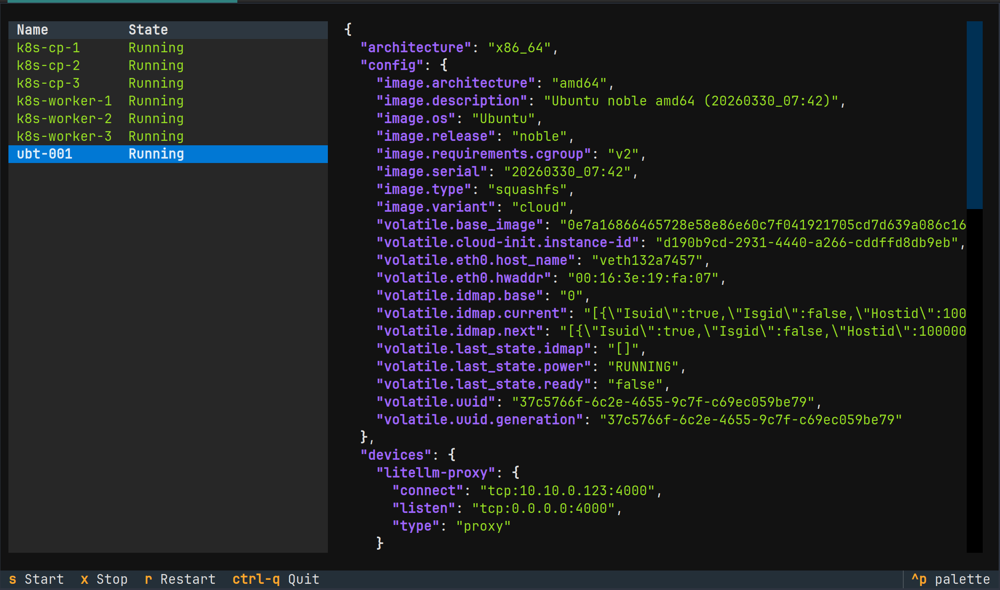
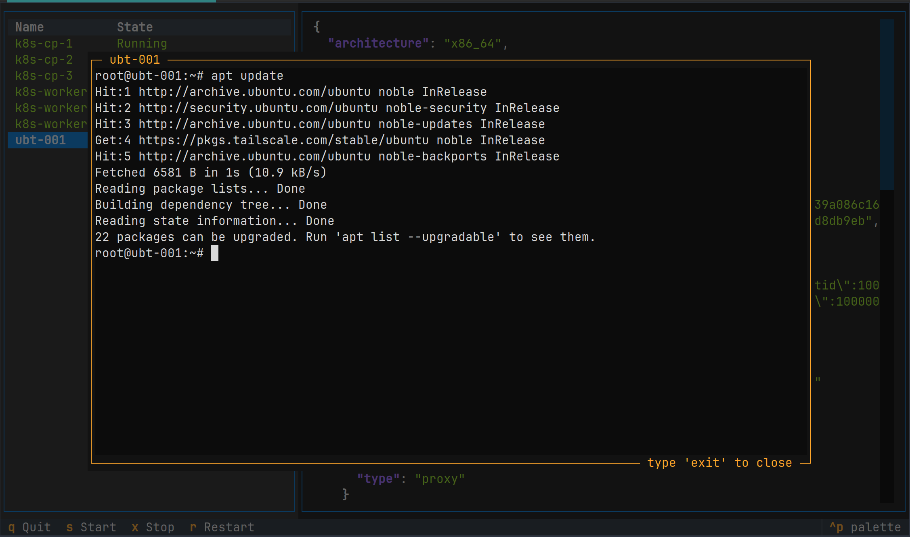

# pIncus

```plaintext
      ___                      
 _ __|_ _|_ __   ___ _   _ ___ 
| '_ \| || '_ \ / __| | | / __|
| |_) | || | | | (__| |_| \__ \
| .__/___|_| |_|\___|\__,_|___/
|_|  Python TUI for Incus API
```

> [!NOTE]
> The `pIncus` project is a time-limited exercise, a 20-40 hour sprint to see what the author can learn about the [Incus](https://linuxcontainers.org/incus/) HTTP API and [Textual](https://textual.textualize.io/). It isn't a full project (yet!) but merely the fulfillment of a [Boot.dev](https://www.boot.dev/courses/build-personal-project-1) personal project, as part of their Back-end Developer Path.

## Explore Instances


## Shell into Instance



## Terms
* **Incus** - [Incus](https://linuxcontainers.org/incus/) is like [Docker](https://www.docker.com/) but for a wider set of workloads
* **Textual** - [Textual](https://textual.textualize.io/) is a Rapid Application Development framework for Python

## Project Name

The Incus part should be self-evident, and the `p` is of course for for `Python`. It also warmed my heart knowing that the given name [Pincus](https://www.ancestry.com/first-name-meaning/pincus) is chosen by parents who wish to honour heritage and family connections.

## Setup

### Enabling Remote Access to an Incus Server

These steps will configure settings in `~/.config/incus` including TLS client credentials and the CA certificate for the remote server. Those certs will be used to connect this Python client.

On the Incus server (`dogwood` is the server, and `jeff-fwk` is a client laptop):

```bash
# ssh to the Incus server
ssh dogwood

# allow remote communications
incus config set core.https_address :3443

# define a trust certificate for the client machine
#    (capture the certificate to your clipboard)
incus config trust add jeff-fmwk
Client jeff-fmwk certificate add token:
<base64-encoded cert to be copied to clipboard>
```

On your laptop:

```bash
# if you haven't already done so, install incus
sudo apt install incus

# add a remote (answer `y [enter]`, and then paste the cert from the server)
incus remote add dogwood https://dogwood:3443

Generating a client certificate. This may take a minute...
Certificate fingerprint: <certificate fingerprint shown here>
ok (y/n/[fingerprint])? y
Trust token for dogwood: <paste base64-encoded cert here>
Client certificate now trusted by server: dogwood

# you're now able to list instances on the remote
incus list dogwood:

# make server dogwood your default server
incus remote switch dogwood

# now you can list instances without specifying the server
incus list

```

### UV and Patches

See [terminal patch](docs/TEXTUAL_TERMINAL_PATCH.md) for textual_terminal import fix.

```bash
uv sync

# fix textual_terminal import, then
uv run main.py
```

## Project Milestones

See [docs/MILESTONES.md](docs/MILESTONES.md) for details.

- [x] Initial brainstorming complete
- [x] Authenticated connectivity to Incus established
- [x] Prototype sketch complete
- [x] First `Textual` TUI spike can call Incus
- [x] Querystring filters successfully interpreted
- [x] Study `Textual` app fundamentals
- [x] Study `Textual` layout examples
- [x] Initial TUI layout prototype
- [x] TUI populated with dummy data
- [x] TUI popluated with live data
- [x] Can navigate into the shell on selected Incus instance

## Roadmap

- [ ] Tabbed details pane
  - [ ] JSON View
  - [ ] Interpreted View (with update controls)

