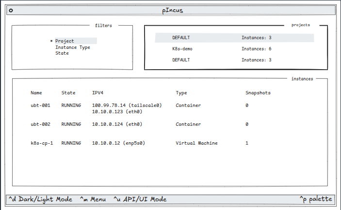

# pIncus

```plaintext
      ___                      
 _ __|_ _|_ __   ___ _   _ ___ 
| '_ \| || '_ \ / __| | | / __|
| |_) | || | | | (__| |_| \__ \
| .__/___|_| |_|\___|\__,_|___/
|_|   A TUI for the Incus API
```

> [!NOTE]
> The `pIncus` project is a time-limited exercise, written as an opportunity to dive into [Textual](https://textual.textualize.io/) in the author's evaluation of various TUI frameworks. It is also the fulfillment of a [Boot.dev](https://www.boot.dev/courses/build-personal-project-1) personal project, as part of their Back-end Developer Path.



## Terms
* **Incus** - [Incus](https://linuxcontainers.org/incus/) is like [Docker](https://www.docker.com/) but for a wider set of workloads
* **Textual** - [Textual](https://textual.textualize.io/) is a Rapid Application Development framework for Python

## Project Name

The Incus part should be self-evident, and the `p` is of course for for `Python`. It also warmed my heart knowing that the given name [Pincus](https://www.ancestry.com/first-name-meaning/pincus) is chosen by parents who wish to honour heritage and family connections.

## Project Milestones

See [docs/MILESTONES.md](docs/MILESTONES.md) for details.

- [x] Initial brainstorming complete
- [x] Authenticated connectivity to Incus established
- [x] Prototype sketch complete
- [x] First `Textual` TUI spike can call Incus
- [ ] TUI layout complete
- [ ] TUI populated with dummy data
  - [ ] Images
  - [ ] Projects
  - [ ] Instances
- [ ] TUI popluated with live data

